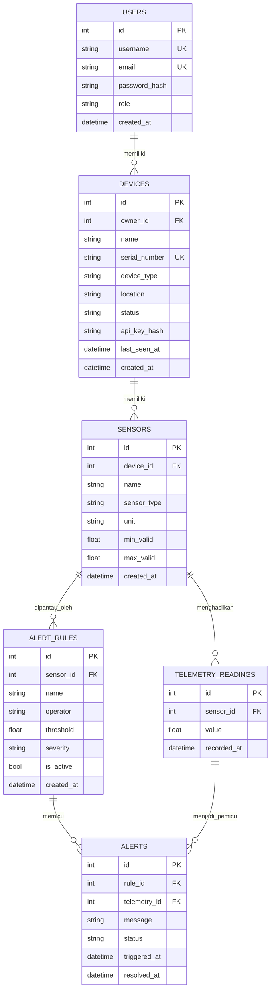

# ERD - IoT Greenhouse Monitoring API

```mermaid
erDiagram
    USERS ||--o{ DEVICES : memiliki
    DEVICES ||--o{ SENSORS : memiliki
    SENSORS ||--o{ TELEMETRY_READINGS : menghasilkan
    SENSORS ||--o{ ALERT_RULES : dipantau_oleh
    ALERT_RULES ||--o{ ALERTS : memicu
    TELEMETRY_READINGS ||--o{ ALERTS : menjadi_pemicu

    USERS {
        int id PK
        string username UK
        string email UK
        string password_hash
        string role
        datetime created_at
    }
    DEVICES {
        int id PK
        int owner_id FK
        string name
        string serial_number UK
        string device_type
        string location
        string status
        string api_key_hash
        datetime last_seen_at
        datetime created_at
    }
    SENSORS {
        int id PK
        int device_id FK
        string name
        string sensor_type
        string unit
        float min_valid
        float max_valid
        datetime created_at
    }
    TELEMETRY_READINGS {
        int id PK
        int sensor_id FK
        float value
        datetime recorded_at
    }
    ALERT_RULES {
        int id PK
        int sensor_id FK
        string name
        string operator
        float threshold
        string severity
        bool is_active
        datetime created_at
    }
    ALERTS {
        int id PK
        int rule_id FK
        int telemetry_id FK
        string message
        string status
        datetime triggered_at
        datetime resolved_at
    }
```

Constraint tambahan: `UNIQUE(sensors.device_id, sensors.name)`, index `(telemetry_readings.sensor_id, recorded_at)`.
